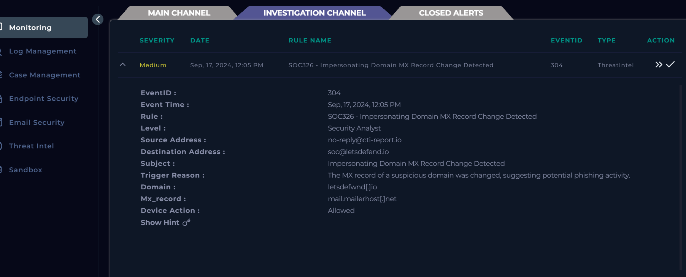
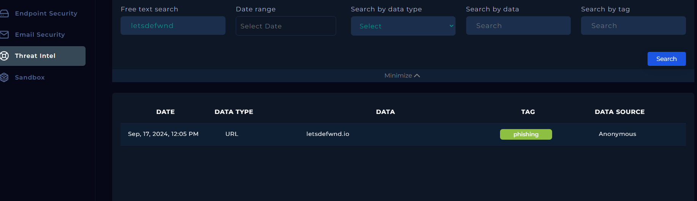
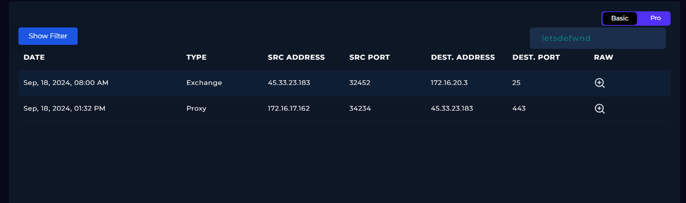
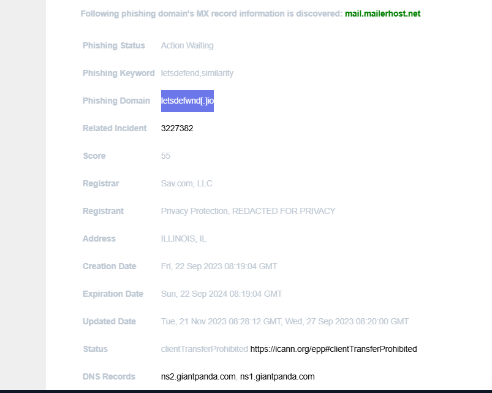
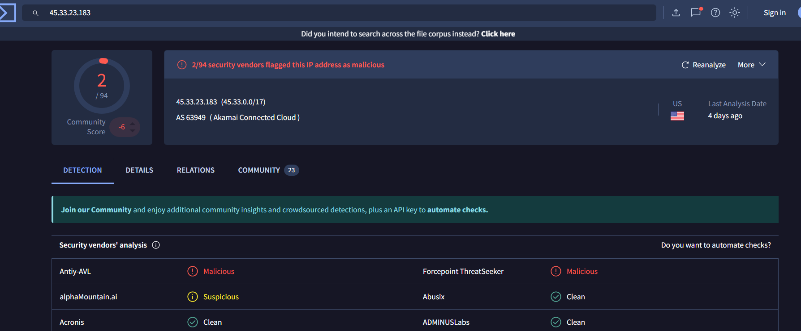
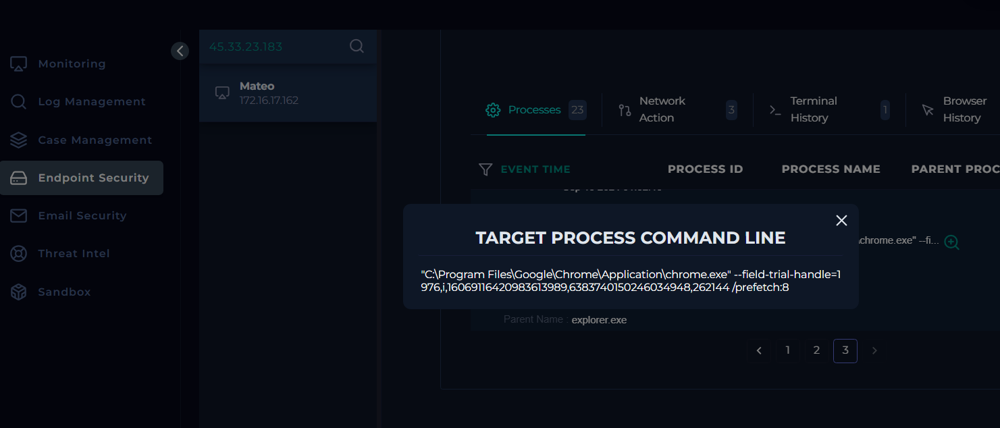

# SOC326 Investigation - Impersonating Domain MX Record Change Detected

## Overview

This project documents a phishing investigation performed in SOC lab after an alert identified a suspicious MX record change associated with an impersonating domain.

The investigation revealed a typosquatted domain, `letsdefwnd.io`, designed to imitate the legitimate `letsdefend.io` domain. The suspicious domain was associated with a phishing URL, a malicious email campaign, inbound mail activity, user interaction, and outbound connectivity to suspicious infrastructure.

The case was validated as a **True Positive phishing incident** involving domain impersonation and user interaction with a malicious URL.

---

## Alert Details

- **Alert Rule:** SOC326 - Impersonating Domain MX Record Change Detected
- **Severity:** Medium
- **Event ID:** 304
- **Event Time:** Sep 17, 2024, 12:05 PM
- **Source Address:** no-reply@cti-report.io
- **Destination Address:** soc@letsdefend.io
- **Subject:** Impersonating Domain MX Record Change Detected
- **Suspicious Domain:** letsdefwnd.io
- **MX Record:** mail.mailerhost.net
- **Device Action:** Allowed

---

## Executive Summary

The investigation started with a threat intelligence alert identifying that the domain `letsdefwnd.io` had a suspicious MX record change. The domain closely resembled the legitimate `letsdefend.io`, indicating a likely typosquatting and brand impersonation attempt.

Further analysis showed that the domain was already tagged as **phishing** in the Threat Intel module. Email review confirmed that a phishing message was delivered from `voucher@letsdefwnd.io` to `mateo@letsdefend.io` with the subject **"Congratulations! You've Won a Voucher"**. The email body contained a phishing lure and a link to the suspicious domain.

SIEM correlation showed email delivery activity, followed by network communication involving `45.33.23.183`, and endpoint telemetry confirmed that user **Mateo** accessed `https://letsdefwnd.io` using `chrome.exe`. VirusTotal also showed the IP as flagged by multiple security vendors. No evidence of file download or secondary payload execution was observed in the provided telemetry.

As a containment action, the affected host was isolated.

---

## Key Findings

- A suspicious domain, `letsdefwnd.io`, impersonated the legitimate `letsdefend.io`
- The domain used the MX record `mail.mailerhost.net`
- Threat Intel tagged the domain as **phishing**
- A phishing email was delivered from `voucher@letsdefwnd.io` to `mateo@letsdefend.io`
- The phishing email contained a URL pointing to the suspicious domain
- User **Mateo** visited `https://letsdefwnd.io`
- Endpoint telemetry confirmed browser execution via `chrome.exe`
- Network logs showed communication involving `45.33.23.183`
- VirusTotal flagged `45.33.23.183` as malicious by multiple vendors
- The host was contained after the investigation
- No clear evidence of file download or malware execution was found

---

## Threat Intel Validation

Threat Intel results showed the suspicious domain `letsdefwnd.io` with a phishing tag.

Additional domain information showed:

- **Registrar:** Sav.com, LLC
- **Registrant:** Privacy Protection, REDACTED FOR PRIVACY
- **Creation Date:** Fri, 22 Sep 2023 08:19:04 GMT
- **Expiration Date:** Sun, 22 Sep 2024 08:19:04 GMT
- **Status:** clientTransferProhibited
- **Name Servers:** ns1.giantpanda.com, ns2.giantpanda.com
- **MX Record:** mail.mailerhost.net

---

## Phishing Email Evidence

The phishing email was sent from `voucher@letsdefwnd.io` to `mateo@letsdefend.io`.

- **Subject:** Congratulations! You've Won a Voucher
- **Date:** Sep 18, 2024, 08:00 AM
- **Action:** Allowed

The email body used a social engineering lure and instructed the victim to visit `http://letsdefwnd.io/`.

---

## Infrastructure and Traffic Correlation

A search for `letsdefwnd` showed relevant infrastructure activity:

- **Exchange:** Sep 18, 2024, 08:00 AM - `45.33.23.183` to `172.16.20.3` over port `25`
- **Proxy:** Sep 18, 2024, 01:32 PM - `172.16.17.162` to `45.33.23.183` over port `443`

A VirusTotal lookup for `45.33.23.183` showed detections from multiple vendors.

---

## Endpoint Evidence

Endpoint telemetry confirmed that user **Mateo** visited the phishing URL using `chrome.exe`.

- **Date:** 2024-09-18 13:32:13
- **User:** Mateo
- **URL:** https://letsdefwnd.io
- **Process:** chrome.exe

No evidence of file download, malicious child process execution, or script-based payload execution was observed in the provided telemetry.

---

## Timeline Summary

| Time | Event |
|------|-------|
| Sep 17, 2024 12:05 PM | SOC alert triggered for suspicious MX record change on `letsdefwnd.io` |
| Sep 17, 2024 12:05 PM | Exchange activity recorded from `no-reply@cti-report.io` to `soc@letsdefend.io` |
| Sep 18, 2024 08:00 AM | Phishing email delivered from `voucher@letsdefwnd.io` to `mateo@letsdefend.io` |
| Sep 18, 2024 08:00 AM | Exchange activity observed involving `45.33.23.183` and mail delivery |
| Sep 18, 2024 01:32 PM | Proxy log recorded communication from `172.16.17.162` to `45.33.23.183` over HTTPS |
| Sep 18, 2024 13:32:13 | Endpoint telemetry confirmed Mateo accessed `https://letsdefwnd.io` via `chrome.exe` |
| Post-investigation | Host was contained |

---

## Indicators of Compromise (IOCs)

### Domains
- `letsdefwnd.io`

### Email Addresses
- `voucher@letsdefwnd.io`
- `no-reply@cti-report.io`

### IP Addresses
- `45.33.23.183`
- `64.233.180.27`

### Infrastructure
- `mail.mailerhost.net`

### User / Host
- User: `Mateo`
- Host IP: `172.16.17.162`

---

## MITRE ATT&CK

| Tactic | Technique | ID | Reason |
|--------|-----------|----|--------|
| Resource Development | Acquire Infrastructure: Domains | T1583.001 | A typosquatted domain was used to impersonate the legitimate brand |
| Initial Access | Phishing: Spearphishing Link | T1566.002 | The victim received a phishing email containing a malicious link |
| Execution | User Execution: Malicious Link | T1204.001 | The victim visited the malicious URL |
| Command and Control / Network Communication | Application Layer Protocol: Web Protocols | T1071.001 | HTTPS communication to attacker-controlled infrastructure was observed |

---

## Final Assessment

This investigation confirmed a phishing incident using a brand-impersonating domain and suspicious email infrastructure.

The domain `letsdefwnd.io` was used as a phishing lure, delivered through email, and visited by the user `Mateo`. Threat Intel, Exchange activity, proxy logs, endpoint evidence, and IP reputation all supported the conclusion that the activity was malicious.

At the same time, the available telemetry did **not** show clear evidence of file download, payload execution, or post-click malware activity. Based on the evidence, this case is best classified as a **True Positive phishing incident with confirmed user interaction and no additional malware execution observed**.

---

## Repository Files

- `README.md` - project summary
- `ANALYSIS.md` - detailed technical investigation
- `TIMELINE.md` - full timeline
- `IOC.md` - indicators of compromise
- `MITRE.md` - ATT&CK mapping
- `DIAGRAM.md` - incident flow diagram

---
